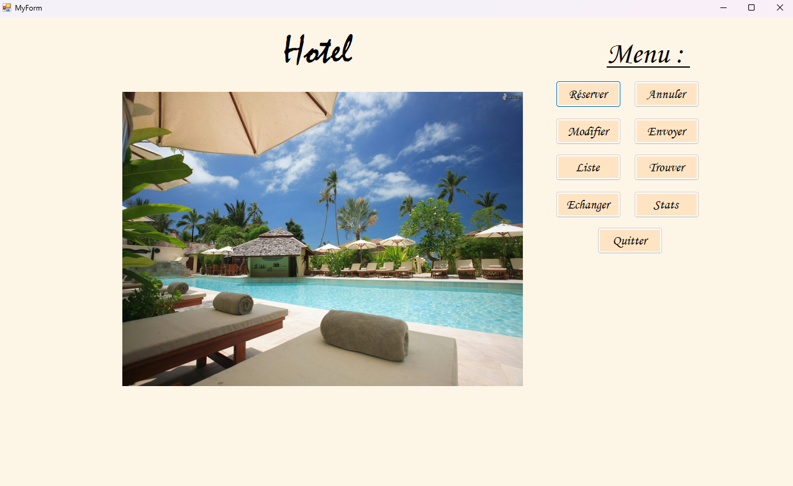
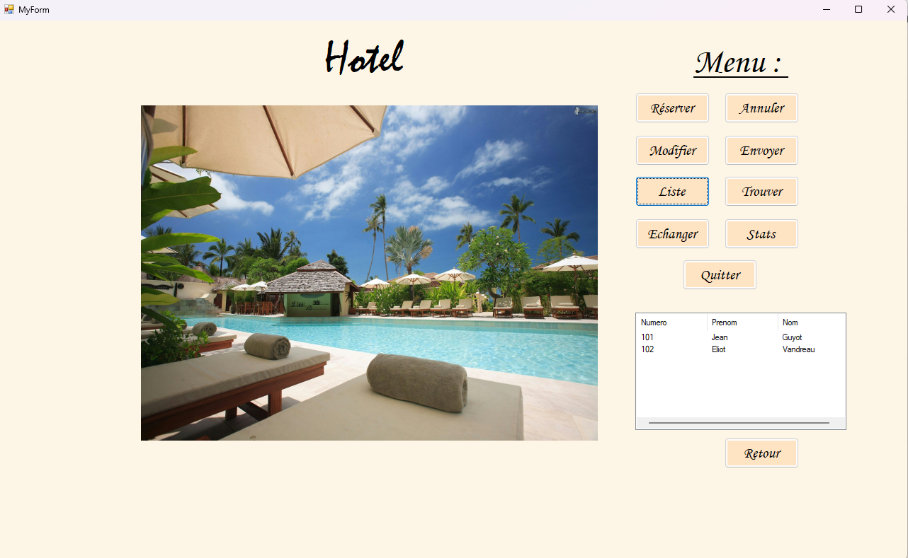

# Hotel Reservation Simulation

## Description

This project is a **hotel reservation simulation** developed in **C++/CLI** with **Windows Forms**.  
It allows users to simulate hotel client management, including adding clients, viewing client information, and checking reservation statistics.  

The system is connected to a **MariaDB database** to store client data and reservation information.

## Features

- **Client Management**: Add, edit, and manage clients easily
- **List View**: Display all registered clients in a structured table
- **Statistics Panel**: View aggregated reservation data
- **Database Integration**: Client and reservation data stored in MariaDB
- **Interactive Interface**: Buttons and panels appear or hide depending on actions
- **Read-only Displays**: Ensure statistics and critical data are safe from accidental modification

### Screenshots of the application interface:

## General view

## List of reservation

## Available Chambers
  

## Prerequisites

- **Visual Studio 2019 or 2022** (with C++/CLI support)
- **MariaDB server** (can be installed via XAMPP or standalone)
- **MySQL Connector/C++** for connecting to MariaDB

## Installation and Setup

1. **Install Visual Studio**  
   - Make sure to include C++/CLI support during installation.  

2. **Install MariaDB**  
   - You can use [XAMPP](https://www.apachefriends.org/) or install MariaDB standalone.  
   - Start the MariaDB server and create a database for the hotel simulation.

3. **Configure the Database**  
   - Create a database (e.g., `hotel_db`) and tables for clients and reservations.  
   - Update the database connection string in the project with your credentials.

4. **Install MySQL/MariaDB C++ Connector**  
   - Download and configure the connector to allow C++/CLI to communicate with MariaDB.  

5. **Open the Project**  
   - Open the `.sln` file in Visual Studio.  
   - Build the project.  
   - Run the application.

## Usage

- Add clients using the client form.  
- View all clients in the list view.  
- Access client details and reservation statistics in the dedicated panels.  
- Navigate between screens using the built-in buttons.

## Author

Your Name  
Date
